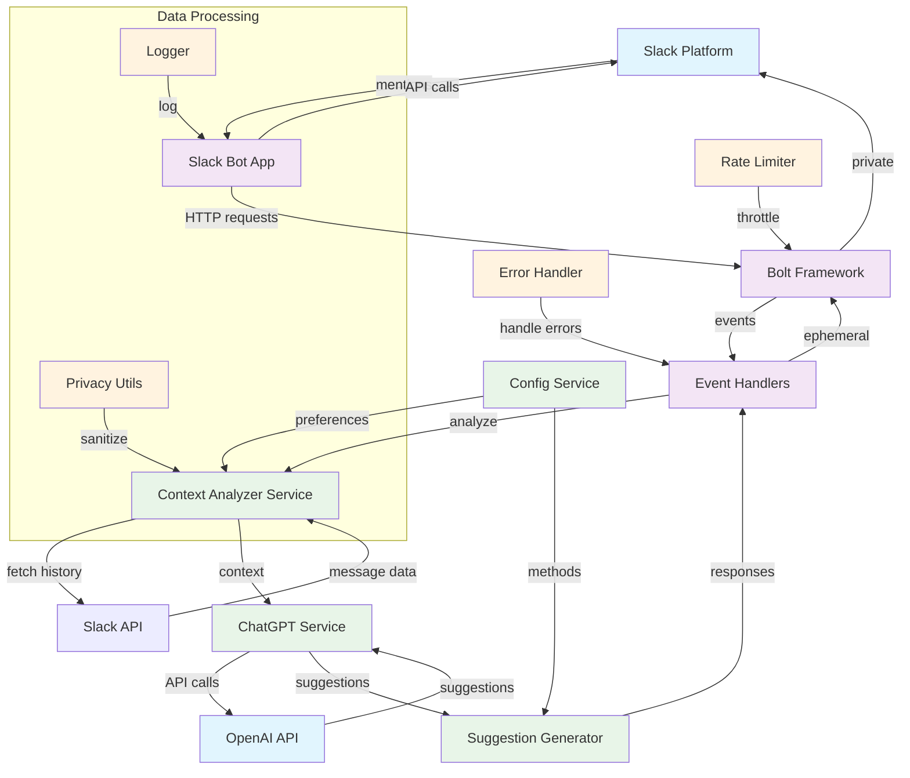

# Slack ChatGPT Assistant Bot

A Slack bot that uses ChatGPT to analyze conversation context and provide intelligent response suggestions. The bot helps teams quickly respond to complex client questions by leveraging conversation history.

## Features

- 🤖 **Smart Context Analysis**: Analyzes up to one month of conversation history
- 💬 **Intelligent Suggestions**: Provides multiple types of response suggestions
- 🔒 **Privacy First**: All suggestions are private and only visible to the requesting user
- ⚙️ **Flexible Configuration**: Multiple analysis methods and user-configurable settings
- 🚀 **Easy Integration**: Simple @mention activation in any Slack channel

## Quick Start

### Prerequisites

- Node.js 18+
- Slack App with appropriate permissions
- OpenAI API key

### Installation

1. Clone the repository:

```bash
git clone <repository-url>
cd slack-chatgpt-assistant
```

2. Install dependencies:

```bash
npm install
```

3. Copy environment template:

```bash
cp env.example .env
```

4. Configure your environment variables in `.env`:

   - Add your Slack bot token, signing secret, and app token
   - Add your OpenAI API key
   - Configure other settings as needed

5. Build the project:

```bash
npm run build
```

6. Start the bot:

```bash
npm start
```

### Development

For development with auto-reload:

```bash
npm run dev
```

Run tests:

```bash
npm test
```

## Usage

### Basic Usage

1. Mention the bot in any Slack channel: `@assistant help me respond to this`
2. The bot will analyze the conversation context and provide suggestions
3. Choose from the suggested responses or modify them as needed

### Configuration

Use the `/assistant config` command to configure analysis methods:

- Full month history analysis
- Recent messages focus
- Thread-specific analysis
- Keyword-based filtering

## Architecture

### System Overview

The Slack ChatGPT Assistant Bot follows a modular architecture with clear separation of concerns. Here's how the different services interact:



### Component Interaction Flow

#### 1. **User Interaction**

```
User @mentions bot → Slack Platform → Bolt Framework → Event Handlers
```

#### 2. **Context Analysis**

```
Event Handlers → Context Analyzer → Slack API (fetch history) → Process & Filter Data
```

#### 3. **AI Processing**

```
Context Analyzer → ChatGPT Service → OpenAI API → Generate Suggestions
```

#### 4. **Response Generation**

```
ChatGPT Service → Suggestion Generator → Format Responses → Event Handlers
```

#### 5. **Response Delivery**

```
Event Handlers → Bolt Framework → Slack Platform → Private User Response
```

### Service Responsibilities

| Service                  | Responsibility          | Key Functions                               |
| ------------------------ | ----------------------- | ------------------------------------------- |
| **Bolt Framework**       | Slack integration layer | Event routing, API communication            |
| **Event Handlers**       | Request processing      | Mention handling, command processing        |
| **Context Analyzer**     | Conversation analysis   | History retrieval, context processing       |
| **ChatGPT Service**      | AI integration          | OpenAI API communication, prompt management |
| **Suggestion Generator** | Response formatting     | Multiple suggestion types, formatting       |
| **Config Service**       | User preferences        | Analysis method configuration               |
| **Rate Limiter**         | Performance control     | Request throttling, abuse prevention        |
| **Error Handler**        | Error management        | Graceful failure handling, logging          |

### Data Flow Architecture

```
src/
├── app.ts                 # Main application entry point
├── config/               # Configuration files
│   ├── environments.ts   # Environment configuration
│   ├── openai.ts        # OpenAI API configuration
│   └── slack.ts         # Slack API configuration
├── handlers/             # Event and command handlers
│   ├── mentionHandler.ts # @mention event processing
│   └── configHandler.ts # Configuration commands
├── services/             # Business logic services
│   ├── contextAnalyzer.ts # Conversation context analysis
│   ├── chatgptService.ts # OpenAI ChatGPT integration
│   ├── suggestionGenerator.ts # Response suggestion generation
│   └── configService.ts # User configuration management
├── middleware/           # Middleware components
│   └── rateLimiter.ts   # Request rate limiting
├── utils/                # Utility functions
│   ├── errorHandler.ts  # Error handling utilities
│   ├── logger.ts        # Logging utilities
│   └── privacyUtils.ts  # Data privacy utilities
└── types/                # TypeScript type definitions
    └── index.ts         # Shared type definitions
```

## Environment Variables

| Variable               | Description                          | Required            |
| ---------------------- | ------------------------------------ | ------------------- |
| `SLACK_BOT_TOKEN`      | Slack bot user OAuth token           | Yes                 |
| `SLACK_SIGNING_SECRET` | Slack app signing secret             | Yes                 |
| `SLACK_APP_TOKEN`      | Slack app-level token                | Yes                 |
| `OPENAI_API_KEY`       | OpenAI API key                       | Yes                 |
| `OPENAI_MODEL`         | ChatGPT model to use                 | No (default: gpt-4) |
| `NODE_ENV`             | Environment (development/production) | No                  |

## Contributing

1. Fork the repository
2. Create a feature branch
3. Make your changes
4. Add tests for new functionality
5. Submit a pull request

## License

ISC License

## Support

For issues and questions, please open an issue on GitHub.
